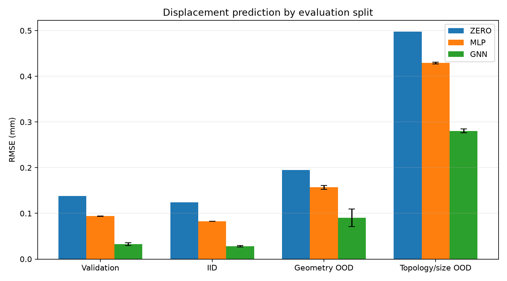
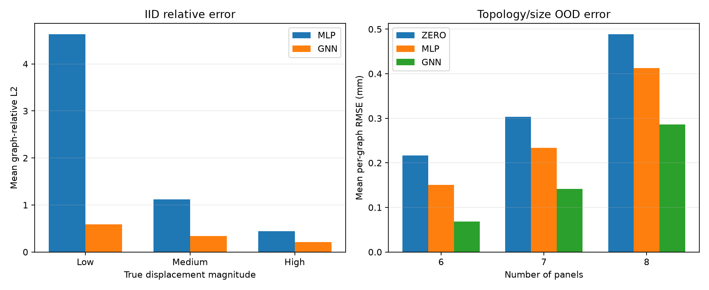
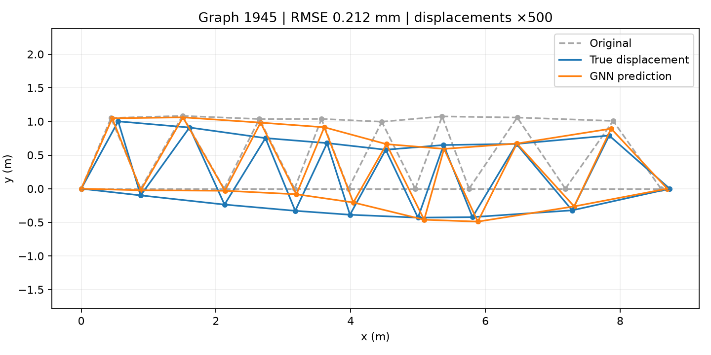

# TrussGNN

TrussGNN is a small research project that compares finite-element solutions with node-level neural predictions for linear-static 2D trusses. It focuses on a reproducible question: does an edge-aware graph neural network predict nodal displacement more accurately than a node-independent MLP when graph geometry, physical bar properties, and topology vary?

## Pipeline

```text
generate and solve trusses with NumPy FEM
→ convert them to PyTorch Geometric graphs
→ normalize using training statistics only
→ train with free-degree-of-freedom loss
→ select the best validation checkpoint
→ evaluate IID and OOD splits
→ analyse errors by displacement magnitude and graph size
```

Each node contains `[x, y, fx, fy, fixed_x, fixed_y]`. Each directed edge contains `[length, cos_theta, sin_theta, E, A]`. The target at every node is normalized `[ux, uy]` displacement. Support flags remain binary and constrained degrees of freedom are excluded from loss and physical metrics.

## Models

- **Zero baseline:** predicts exactly zero physical displacement and has no learned parameters.
- **Node MLP:** applies the same two-hidden-layer MLP independently to every node. It deliberately ignores connectivity and edge properties.
- **Edge-aware GNN:** uses three GINE message-passing layers, connectivity, and physical edge features before predicting two displacement components per node.

## Dataset

The evaluation dataset uses seed 42 and contains one controlled family of triangular-chain trusses:

| Split | Graphs | Purpose |
|---|---:|---|
| Training | 1,200 | Model fitting and normalization statistics |
| Validation | 200 | Early stopping and checkpoint selection |
| IID test | 200 | Held-out structures from training ranges |
| Geometry OOD | 200 | Geometry outside training ranges |
| Topology/size OOD | 200 | Larger six-, seven-, and eight-panel graphs |

## Training and evaluation

The MLP and GNN were trained with seeds 7, 19, and 42 using Adam, batch size 32, learning rate 0.001, and validation-based early stopping. The best validation checkpoint was restored before evaluating test splits. Metrics use physical free-DOF displacement: RMSE and MAE in millimetres, plus relative L2 calculated independently per graph.

### Aggregate RMSE results

Learned-model values are mean ± sample standard deviation across three training seeds.

| Model | Validation | IID | Geometry OOD | Topology/size OOD |
|---|---:|---:|---:|---:|
| Zero | 0.138165 | 0.124017 | 0.194650 | 0.497463 |
| MLP | 0.093833 ± 0.000281 | 0.082498 ± 0.000088 | 0.157026 ± 0.004131 | 0.429232 ± 0.001988 |
| GNN | 0.032646 ± 0.002766 | 0.028270 ± 0.001456 | 0.090581 ± 0.019292 | 0.280424 ± 0.004206 |



The GNN outperformed the paired MLP in all 12 seed/split comparisons. Its absolute OOD error remained the lowest, although both learned models degraded outside the training distribution.

## Per-graph error analysis

The MLP's relative error was concentrated in low-displacement graphs: its mean relative L2 was approximately 4.65 for low-magnitude validation and IID graphs, despite improved aggregate RMSE. The GNN reduced this to 0.75 on validation and 0.59 on IID. Topology/size-OOD absolute error increased with panel count; mean GNN per-graph RMSE rose from 0.068 mm at six panels to 0.286 mm at eight panels.



The representative prediction is the seed-42 GNN eight-panel topology-OOD graph nearest the median per-graph RMSE, rather than a hand-picked best example. Displacements are amplified only for visualization.



## Installation and execution

```bash
conda create -n trussgnn python=3.11
conda activate trussgnn
python -m pip install -e ".[test]"
python -m pytest -q
```

Generate the deterministic dataset:

```bash
python -m trussgnn.data.generate_dataset \
  --output data/processed \
  --seed 42
```

Run one example GNN experiment using the project's local MLflow default:

```bash
python -m trussgnn.experiments.run_experiment \
  --dataset-dir data/processed \
  --model gnn \
  --experiment-name TrussGNN \
  --run-name gnn-seed42 \
  --seed 42 \
  --layers 3
```

The checked-in figures summarize the completed multi-seed evaluation. Generated datasets, checkpoints, analysis outputs and MLflow state are intentionally excluded from version control.

## Limitations

- Labels come from the same simplified linear-static 2D FEM solver.
- The dataset covers one synthetic family of triangular-chain trusses.
- OOD cases are controlled synthetic extrapolations, not industrial structures.
- Only one MLP and one GNN architecture were compared.
- Three training seeds provide a useful stability check, not a large statistical study.
- The models predict displacement, not stress, failure, or optimized designs.
